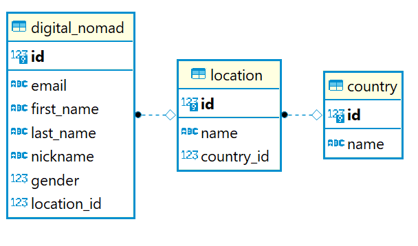

# Digital Nomad Destinations

## Description

This application is designed for the digital nomad community.

It helps you choose the best destinations and keep in touch with other nomads.

## 1. Endpoints

### Operations on Countries

- POST /countries Add a new country.
- GET /countries Retrieve all countries.
- GET /countries/{id} Get a country by its id.
- PUT /countries/{id} Update a country by its id.
- DELETE /countries/{id} Delete a country by its id.
- GET /countries/{id}/locations Get all locations from a country
- GET /countries/{id}/nomads Get all nomads currently in this country

### Operations on Locations

- POST /locations Add a new location
- GET /locations Retrieve all locations.
- GET /locations/{id} Get a location by its id.
- PUT /locations/{id} Update a location by its id.
- DELETE /locations/{id} Delete a location by its id.
- GET /locations/{id}/nomads Get all nomads currently in this location

### Operations on Digital Nomads

- POST /nomads Add a new digital nomad
- GET /nomads Retrieve all digital nomads.
- GET /nomads/{id} Get a digital nomad by its id.
- PUT /nomads/{id} Update a digital nomad by its id.
- DELETE /nomads/{id} Delete a digital nomad by its id.
- PATCH /nomads/{id}/relocate/{locationId} Update a digital nomad's location by its id.

## 2. Database Diagram

## 3. Documentation

- /swagger-ui
- /api-docs

## 4. Background materials
- [Apache Maven Tutorial](https://www.baeldung.com/maven)
- [Learn Spring Boot](https://www.baeldung.com/spring-boot)
- [Learn JPA & Hibernate](https://www.baeldung.com/learn-jpa-hibernate)
- [Spring Boot with Hibernate](https://www.baeldung.com/spring-boot-hibernate)
- [Database Migrations with Flyway](https://www.baeldung.com/database-migrations-with-flyway)
- [Documenting a Spring REST API](https://www.baeldung.com/spring-rest-openapi-documentation)
- [Integration Testing in Spring](https://www.baeldung.com/integration-testing-in-spring)  
